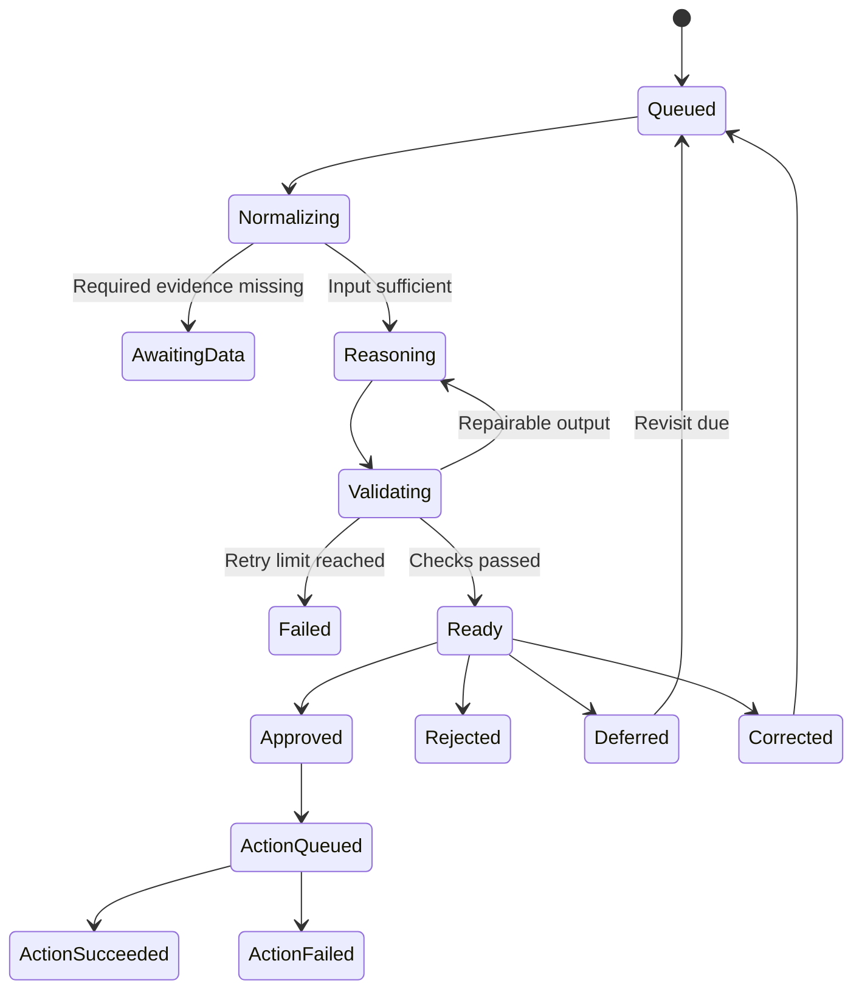

# AI System Design

## Responsibility split

### Deterministic code

- normalize billing periods;
- compute monthly and annual costs and savings;
- aggregate usage and transaction frequency;
- detect known duplicates, price changes, and inconsistencies;
- validate schemas and domain rules;
- enforce approval, retries, and timeouts;
- produce audit records.

### Model

- interpret incomplete or competing signals;
- select one allowed recommendation action;
- identify relevant evidence;
- state uncertainty and request missing information;
- explain trade-offs in plain language;
- answer bounded follow-up questions using stored evidence.

## Conceptual recommendation schema

```json
{
  "schema_version": "1.0",
  "subscription_id": "uuid",
  "action": "keep | downgrade | cancel | review",
  "confidence": {"score": 0.0, "label": "low | medium | high"},
  "reason": "string",
  "evidence": [
    {
      "type": "transaction | usage | preference | plan | user_statement",
      "fact": "string",
      "source_reference": "string"
    }
  ],
  "uncertainties": ["string"],
  "follow_up_question": "string or null",
  "estimated_savings": {
    "currency": "ISO-4217 code",
    "monthly": "decimal string",
    "annual": "decimal string",
    "calculation_reference": "string"
  },
  "suggested_plan": "string or null",
  "approval_required": true,
  "prompt_version": "string",
  "model_reference": "string"
}
```

Money uses decimal values. Savings come from a tested tool and are referenced by the recommendation.

## State machine



## Prompt lifecycle

Prompts are versioned, reviewed like code, linked to outputs, evaluated before promotion, protected from untrusted imported data, and rollback-capable. A prompt or model change must run against the evaluation baseline.

## Guardrails

- enumerated actions only;
- schema validation for all model output;
- source references for factual claims;
- rejection of unsupported savings;
- imported text treated as data, never instructions;
- minimum necessary personal data sent to providers;
- secrets and irrelevant identifiers redacted;
- token, timeout, cost, and retry limits;
- explicit action approval;
- sensitive prompt content excluded from ordinary logs.

## Evaluation dimensions

- recommendation correctness;
- factual grounding;
- savings accuracy;
- uncertainty calibration;
- usefulness of follow-up questions;
- schema compliance;
- action safety;
- repeated-run consistency;
- latency and cost.

Critical failures include fabricated usage, invented savings, acting without approval, or following instructions embedded in imported financial data.
