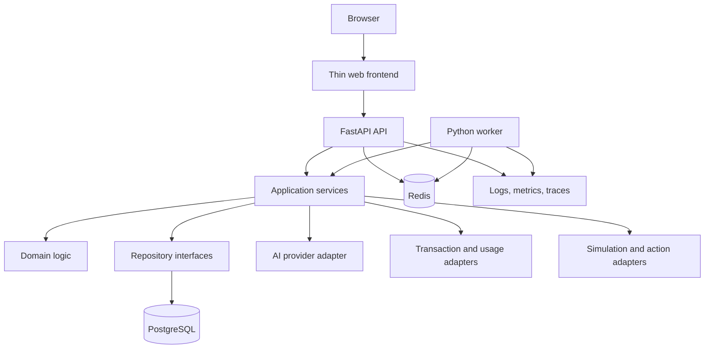
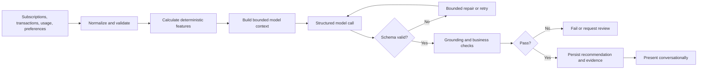
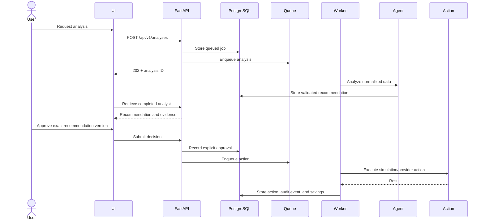

# Shared-System Architecture

## Style

The shared MVP uses a modular monolith with a separate frontend and background worker. It provides realistic boundaries without premature microservices.

Redis and a worker become active shared-system dependencies only when asynchronous analysis is implemented. The initial scaffold does not fake worker behavior.

## Responsibilities

### Frontend

- subscription and usage management;
- analysis progress and recommendation inbox;
- evidence, uncertainty, and savings presentation;
- follow-up conversation;
- approval, rejection, correction, and postpone controls;
- action and savings history.

### FastAPI

- versioned HTTP API and OpenAPI documentation;
- authentication and authorization;
- input validation and consistent errors;
- idempotency and rate-limit boundaries;
- application-service orchestration;
- health and readiness checks.

### Domain and application

- domain invariants and state machines;
- use-case orchestration and transaction boundaries;
- savings rules;
- approval policy;
- repository and provider interfaces;
- audit-event creation.

### Agent service

- bounded context construction;
- prompt and schema version selection;
- tool calls;
- model invocation;
- structured-output validation;
- grounding, policy, and quality checks;
- bounded repair and retry behavior.

### Worker

- long-running analysis;
- scheduled reanalysis;
- simulated or provider actions;
- notifications;
- retries and dead-letter behavior.

## Analysis flow

## Approval sequence

## Failure principles

- Retries are bounded and classified.
- Incomplete evidence differs from provider failure.
- Actions use idempotency keys.
- Approval is tied to an immutable recommendation version.
- Redis is not the source of truth for domain state.
- The model cannot mark an action successful.
