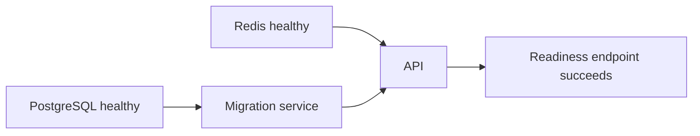

# Docker and Local Development

## Dependency management

Python dependencies are managed by [`uv`](https://docs.astral.sh/uv/), not pip requirements files.

- `backend/pyproject.toml` declares dependencies and tool configuration.
- `backend/uv.lock` locks exact resolutions.
- `uv sync --group dev` creates/synchronizes the development environment.
- `uv run ...` runs commands in that environment.
- Docker uses the locked environment with `uv sync --frozen`.

## Current Compose services

| Service | Purpose |
|---|---|
| `postgres` | PostgreSQL source of truth |
| `redis` | Future queue broker and short-lived cache |
| `migrate` | One-shot Alembic migration execution |
| `api` | FastAPI service |

The worker and scheduler are added when asynchronous shared-product behavior is implemented. Redis exists now to make the intended local topology explicit, not to imply background jobs already work.

## Startup flow



## Local commands

From `backend/`:

```bash
uv sync --group dev
uv run alembic upgrade head
uv run uvicorn app.main:app --reload
uv run pytest
uv run ruff check .
uv run ruff format --check .
uv run mypy app
```

From the repository root:

```bash
docker compose up --build
docker compose down
docker compose logs -f api
```

Use `docker compose down -v` only when intentionally deleting local database and Redis volumes.

## Docker principles

- pinned Python base;
- dependencies resolved from `uv.lock`;
- non-root application user;
- one backend image reused by API, migrations, and future worker;
- source bind mounts only in development overrides;
- no secrets in images;
- health checks and graceful shutdown;
- PostgreSQL and Redis are private in production.

## Configuration

`.env.example` documents safe local values. Real environments use a secret manager. Configuration is loaded through typed Pydantic settings.

The application should eventually distinguish adapter modes such as `mock`, `sandbox`, and `live`.
