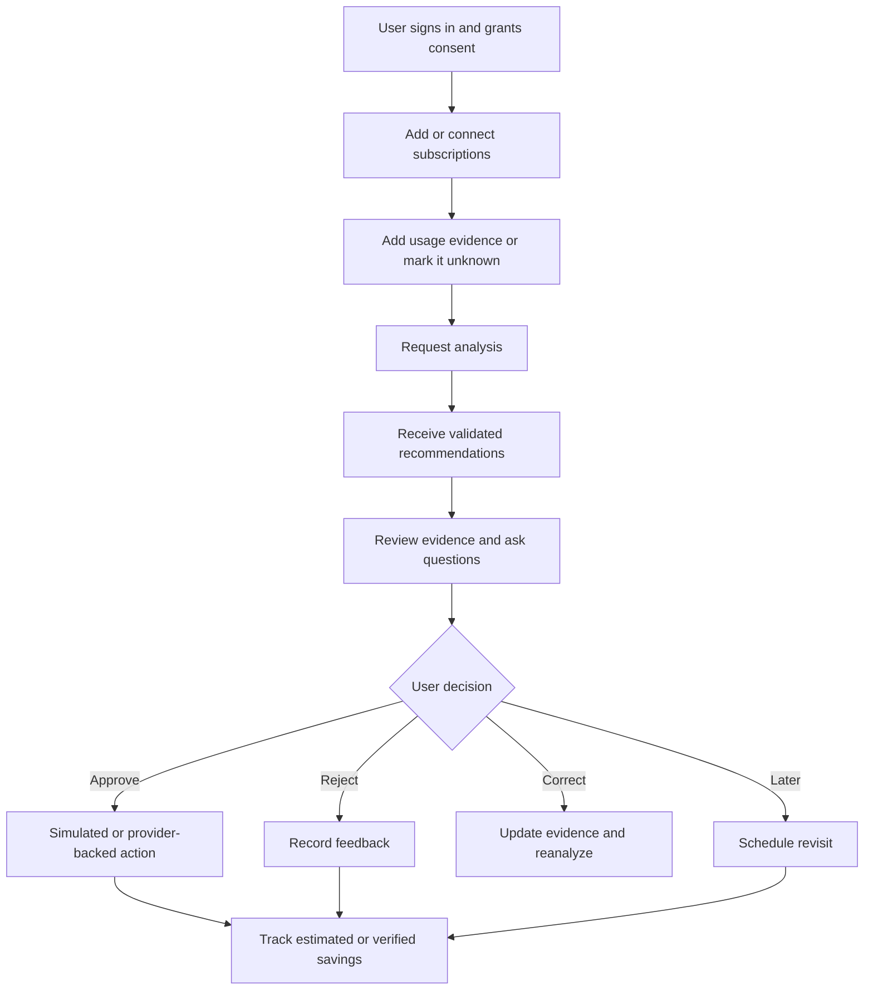

# Product Vision and Scope

## Problem

People often keep paying for subscriptions they rarely use, could replace with cheaper plans, or no longer value. Recurring-payment detection alone does not answer the personal question: **Is this service worth its cost for this user, and what should they do next?**

## Vision

Build a trustworthy financial decision assistant that combines recurring charges, explicit usage evidence, plan information, and user preferences to recommend `keep`, `downgrade`, `cancel`, or `review`.

For every recommendation, the user should understand:

- the recommended action;
- the evidence supporting it;
- missing or conflicting information;
- confidence and uncertainty;
- possible monthly and annual savings;
- what will happen if the action is approved.

Bank transactions do not prove application usage. Missing usage information must remain unknown and may require a follow-up question.

## Guiding principles

1. Learning before specialization.
2. Evidence before intuition.
3. Deterministic code before model guesses.
4. Structured outputs before free-form prose.
5. Explicit approval before consequential action.
6. Uncertainty is stored and shown.
7. API-first shared-system delivery.
8. Provider integrations remain replaceable adapters.
9. Evaluations are part of the product.
10. Privacy and data minimization are core requirements.

## Solo prototype scope

Each person builds only the narrow recommendation loop using shared sample data. It excludes production authentication, a full frontend, real bank connections, distributed infrastructure, and cancellation automation.

## Shared MVP scope

- authentication and consent records;
- manual subscriptions, transactions, and usage evidence;
- realistic seeded data;
- asynchronous analysis jobs;
- evidence-grounded structured recommendations;
- conversational follow-up;
- approval, rejection, correction, and postponement;
- simulated cancel and downgrade actions;
- estimated savings tracking;
- prompt versioning and evaluation runs;
- a thin web interface;
- PostgreSQL, Docker, tests, audit events, and observability.

## MVP non-goals

- holding or moving money;
- universal cancellation automation;
- autonomous action without approval;
- claiming usage that was not supplied;
- financial, tax, legal, or investment advice;
- supporting every country and data provider;
- training a foundation model;
- premature microservices.

## End-state journey

The end goal is not simply a dashboard. It is a system the team can explain, evaluate, debug, operate, and improve.
