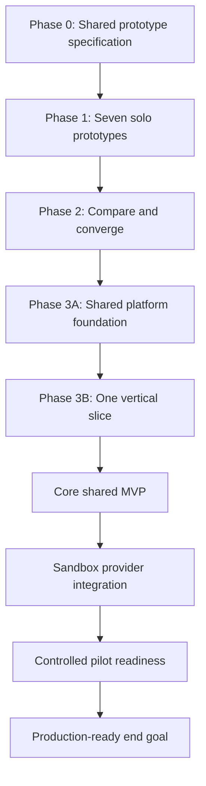

# Learning and Delivery Roadmap

## Phase sequence



## Phase 0 - Shared specification

Create and approve:

1. domain terminology;
2. prototype task and constraints;
3. canonical input schema;
4. recommendation schema;
5. golden and adversarial cases;
6. comparison rubric;
7. demonstration template.

**Exit:** Everyone can explain and run the same task.

## Phase 1 - Seven solo prototypes

Each participant delivers a runnable narrow AI loop, deterministic tools, validation, evaluation results, and a learning report.

**Exit:** Every person can explain prompting, structured output, tools, grounding, failure handling, and evaluation.

## Phase 2 - Comparison and convergence

Run the shared cases, compare results, choose shared contracts, and record decisions.

**Exit:** The team defends the shared design using evidence.

## Phase 3A - Shared foundation

Finalize the FastAPI structure, PostgreSQL migrations, Docker topology, configuration, logging, CI, and agreed domain/API contracts.

The repository now includes the minimal technical starting point, but product modules wait for Phase 2.

## Phase 3B - Vertical slice

Build one complete flow before adding breadth:

```text
seeded subscription -> analysis request -> queued job
-> validated recommendation -> evidence display -> approval
-> simulated action -> savings record
```

**Exit:** The flow works through API and minimal UI, is tested, and is observable.

## Core MVP

Add authentication, consent, manual data management, multiple recommendations, conversation, corrections, decisions, simulated actions, savings, prompt versioning, and evaluation tooling.

## Sandbox integration

Add one transaction-data sandbox behind an adapter, including consent, sync, webhooks, freshness, reconciliation, and idempotency.

## Pilot readiness

Complete privacy review, threat model, backup restoration, runbooks, alerts, performance and cost tests, evaluation thresholds, rollout, and rollback.

## End goal

A reliable and explainable subscription decision system with evidence-grounded recommendations, honest uncertainty, human-controlled actions, measurable quality, provider independence, production-grade operations, and a team that understands every important AI-system layer.

## Separate success measures

### Learning

- all seven prototypes completed;
- everyone explains the full AI loop;
- failures documented;
- shared decisions cite evaluation evidence;
- cross-lane reviews continue during shared development.

### Product

- vertical slice works without database intervention;
- evidence and uncertainty are visible;
- no action without exact approval;
- failures are visible and recoverable;
- savings are traceable.

### Engineering

- Docker startup is repeatable;
- PostgreSQL migrations and tests run in CI;
- critical flows have logs and traces;
- secrets remain outside images and source;
- provider modes are replaceable.
